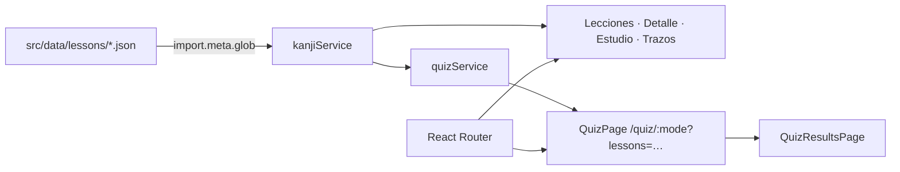

<div align="center">

<!-- TODO: crear docs/banner-dark.png y docs/banner-light.png (1280x640) con la paleta de noeosorio.com (fondo #18181b, acento #bef264 → #10b981) y descomentar
<picture>
  <source media="(prefers-color-scheme: dark)" srcset="docs/banner-dark.png">
  
</picture>
-->

# 🎯 Kanji Study App

**Aprende kanji japonés en español con lecciones cortas, práctica de trazos y quizzes estilo Duolingo.**


</div>

Kanji Study App es una web app mobile-first para hispanohablantes que empiezan con el japonés (nivel JLPT N5). Cada lección agrupa unos pocos kanji con sus lecturas onyomi/kunyomi, frases de ejemplo y un lienzo para practicar el trazo; después puedes ponerte a prueba con seis modos de quiz. Todo corre en el navegador, sin backend ni cuentas.

<details>
<summary>Contenido</summary>

- [✨ Features](#-features)
- [🖼️ Demo](#️-demo)
- [🚀 Quickstart](#-quickstart)
- [⚙️ Configuración](#️-configuración)
- [🏗️ Arquitectura](#️-arquitectura)
- [📁 Estructura](#-estructura)
- [🗺️ Roadmap](#️-roadmap)
- [🤝 Contribuir](#-contribuir)
- [📄 Licencia](#-licencia)

</details>

## ✨ Features

| | Feature | Detalle |
|---|---|---|
| 📚 | **Lecciones N5** | 4 lecciones con 27 kanji (日 月 火 水 木, familia, escuela, tamaños…) cargadas desde JSON |
| 🈁 | **Ficha de kanji** | Significado, onyomi/kunyomi, número de trazos, radicales y frases de ejemplo |
| ✍️ | **Práctica de trazos** | Lienzo con cuadrícula guía, deshacer y limpiar (`KanjiCanvas`) |
| 🃏 | **Modo estudio** | Tarjetas de frases que se voltean, con navegación por teclado (← → Espacio Esc) |
| 🧠 | **6 modos de quiz** | Kanji → significado, kanji → onyomi, significado → kanji, onyomi → kanji, kunyomi → kanji y mixto |
| 🎯 | **Quiz multi-lección** | Elige una o varias lecciones antes de empezar; las preguntas se mezclan sin duplicados |
| 📊 | **Resultados** | Porcentaje de aciertos y repaso al terminar cada quiz |

## 🖼️ Demo

<!-- TODO: agregar docs/demo.gif (flujo lección → trazo → quiz en viewport móvil) -->
Demo próximamente.

## 🚀 Quickstart

### Requisitos

- Node.js 20.19+ o 22.12+ (lo exige Vite 7)
- npm

### Instalación

```bash
git clone https://github.com/NoeOsorio/kanjy-study-app.git
cd kanjy-study-app
npm install
npm run dev
```

Abre http://localhost:5173 (idealmente con la vista móvil de las DevTools).

| Comando | Qué hace |
|---|---|
| `npm run dev` | Servidor de desarrollo con HMR |
| `npm run build` | Chequeo de tipos (`tsc -b`) y build de producción en `dist/` |
| `npm run preview` | Sirve el build de producción localmente |
| `npm run lint` | ESLint sobre todo el proyecto |

## ⚙️ Configuración

No necesita variables de entorno. El contenido vive en `src/data/lessons/*.json` y se carga automáticamente con `import.meta.glob`.

Para añadir una lección, copia la plantilla y rellénala:

```bash
cp src/data/lesson.template.json src/data/lessons/mi-leccion.json
```

> [!NOTE]
> Cada lección necesita un `id` único y un array `kanji`; `examples` se indexa por el carácter del kanji. Los significados van en español.

## 🏗️ Arquitectura



SPA con React Router: las pantallas principales comparten `AppLayout` con navegación inferior; el quiz, los resultados y la práctica de trazos van a pantalla completa. No hay persistencia: el progreso no se guarda entre sesiones.

## 📁 Estructura

<details>
<summary>Ver estructura</summary>

```text
src/
├── components/   # KanjiCanvas, LessonSelector, QuizModeSelector, ExampleCard…
├── data/
│   ├── lesson.template.json
│   └── lessons/  # n5-basics, n5-family, n5-school, n5-size
├── hooks/        # useNavigation
├── pages/        # Home, Lessons, LessonDetail, KanjiDetail, StudyMode, Practice, Quiz…
├── services/     # kanjiService (carga de lecciones), quizService (generación de preguntas)
└── types/        # Kanji, Lesson, QuizMode, QuizQuestion…
docs/             # Bitácora de desarrollo por días
```

</details>

La bitácora del desarrollo (decisiones y retos por día) está en [`docs/`](docs/README.md).

## 🗺️ Roadmap

- [x] Lecciones N5 desde JSON
- [x] Práctica de trazos y modo estudio
- [x] Quiz con 6 modos y selección de varias lecciones
- [ ] Perfil de usuario (la página existe pero aún no está enrutada)
- [ ] Progreso persistente y rachas
- [ ] Autenticación y backend para lecciones dinámicas
- [ ] Modo offline (PWA)

## 🤝 Contribuir

Issues y pull requests son bienvenidos. Antes de abrir un PR, verifica que `npm run lint` y `npm run build` pasen. Para aportar contenido, añade una lección nueva siguiendo la plantilla de [Configuración](#️-configuración).

## 📄 Licencia

Distribuido bajo licencia MIT. Ver [`LICENSE`](LICENSE).

---

<div align="center">

Hecho con ☕ por [Noé Osorio](https://noeosorio.com) · [business@noeosorio.com](mailto:business@noeosorio.com)

</div>
